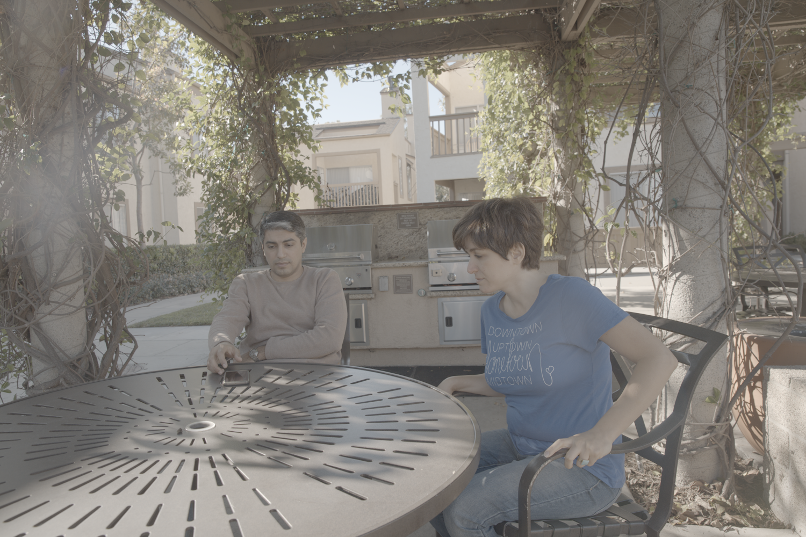
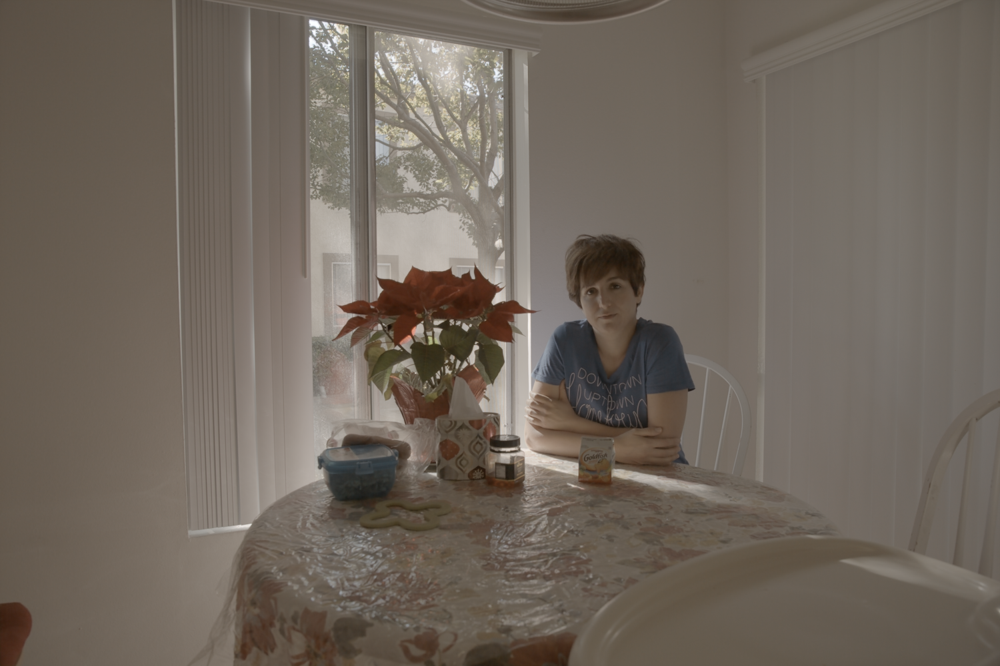
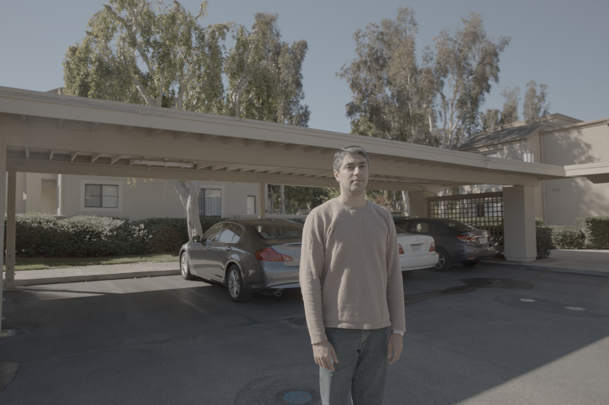

# AHDRNet

This project is an attempt to reproduce the experiment described
[here](https://donggong1.github.io/ahdr) [1]. Unlike previous methods directly
stacking the LDR images or features for merging, this paper use attention
modules to guide the merging according to the reference image. The attention
modules automatically suppress undesired components caused by misalignments and
saturation and enhance desirable fine details in the non-reference images.

In addition to the attention model, we use dilated residual dense block (DRDB)
to make full use of the hierarchical features and increase the receptive field
for hallucinating the missing details. The proposed AHDRNet is a non-flow based
method, which can also avoid the artifacts generated by optical-flow estimation
error.

## Paper

[1] Yan, Qingsen and Gong, “Attention-guided Network for Ghost-free High
Dynamic Range Imaging,” The IEEE Conference on Computer Vision and Pattern
Recognition (CVPR), 2019.

## Code

Dependencies are managed with [`pipenv`](https://pypi.org/project/pipenv/). To
download and install dependencies locally, run:

```sh
$ pipenv install
```

## Training & Test Data

Download the training and test data sets, run `download_datasets.sh`.

Then run the training script, which will update the trained model under `model`:

```sh
$ pipenv run python train.py
```

## The Results

| Output                     | Label                       |
| -------------------------- | --------------------------- |
|   |   |
|  |  |
|  |  |

